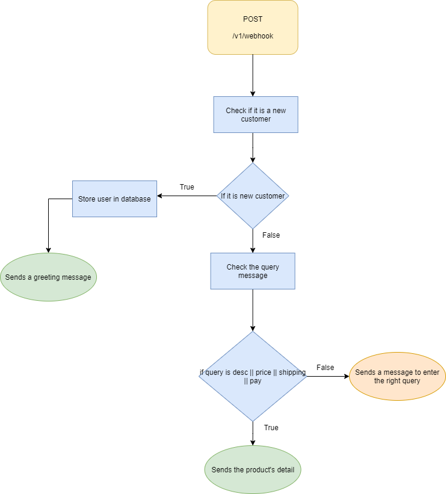

# Facebook Page App

As you may be aware, many businesses use Facebook Pages all around the world. People can contact you through your Facebook page. 
There are several features that are implemented in this app to send messages such as greeting messages and product's details to the customers.

## Databases

|Model| Description |
|--|--|
|User| Store customers from Facebook's messenger

## Features
- Greet first time user with welcoming message. 
- Return product's description via chat based on query.
- Return product's price via chat based on query.
- Return product's shipping fee via chat based on query.
- Notify the developer if there is a customer buying a product via Sendgrid Email API.

## List Of APIs

| No. | Method | API Endpoint | Description |
|--- | ---- | ------ | ------------------ | 
| 1 | GET | /v1 | Checks API health | 
| 2 | GET| /v1/webhook | To verify the webhook with Facebook Messenger App 
| 3 | POST| /v1/webhook | To handle webhook's events

## API Flow Diagram

 
 
 Figure 1 : API No. 2 
 

 
 
 Figure 2 : API No. 3 
 

## Environment Variables

To develop the app, you will need to add the following environment variables to your .env file

`APP_PORT`

`DB_USERNAME`

`DB_PASSWORD`

`DB_DATABASE`

`DB_HOST`

`DB_PORT`

`FB_VERIFY_TOKEN`

`PAGE_ACCESS_TOKEN`

`SG_API_KEY`

`SG_EMAIL_SENDER`

`SG_EMAIL_RECEIVER`

`SG_EMAIL_NAME`

Refer env.example file from the repository.

## Tech Stack

**Server:** NodeJS v14, Express

**Database:** MySQL (Sequelize ORM)

## Demo

 
 
 Figure 3 : Demo 
 

  

  